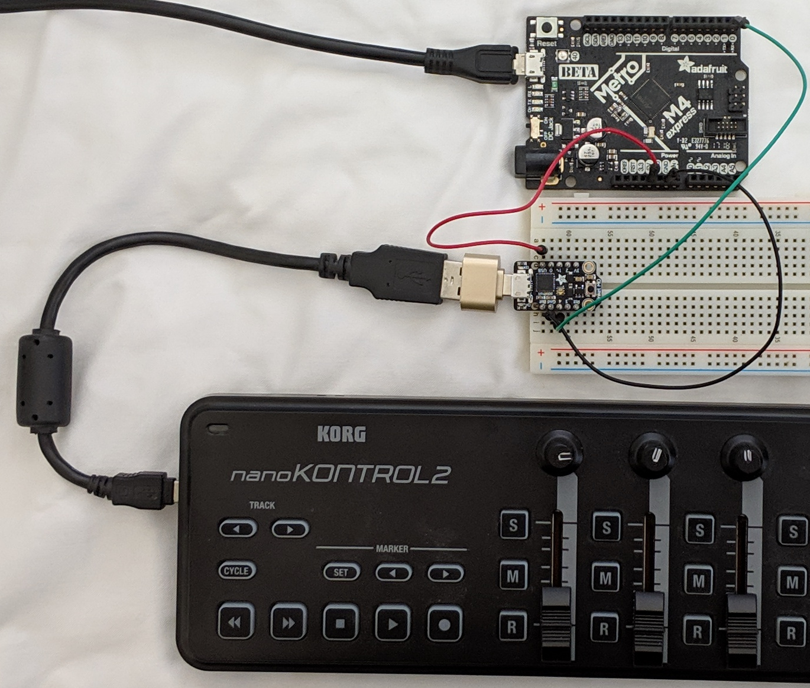
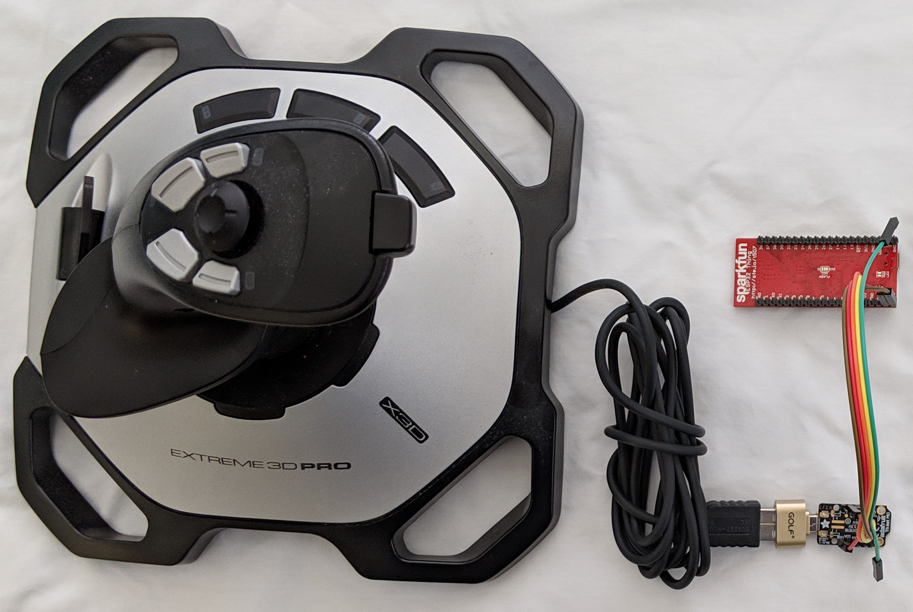

# USB Host Co-Processor



The USB Host co-processor connects USB devices such as USB keyboards to
devolpment boards without USB host ports or without USB host software. The
connection is made via UART.  Device specific firmware is programmed into the
USB Host co-processor by dragging and dropping a firmware file.

The USB Host co-processor handles the complexities of USB host protocol and
communicates the raw data via UART. For example, the USB MIDI firmware sends
and receives MIDI messages at 115,200 bits/sec via UART. It is bi-directional
and can handle System Exclusive messages up to 1024 bytes.

This open source project is based on the [USB Host Library for
SAMD](https://github.com/gdsports/USB_Host_Library_SAMD) which is a port of the
[USB Host Shield Library 2.0](https://github.com/felis/USB_Host_Shield_2.0).

The hardware is an Adafruit Trinket M0 with a USB OTG to host cable or adapter.
The Trinket M0 has a UF2 bootloader which means it appears as a USB drive.
Firmware is burned into the device by dragging and dropping a firmware file
on to the USB drive. There is no need to install USB serial drivers, IDEs, or
source code unless you want to change the source code.

See the [firmware](./firmware) directory for the latest releases.

Using a UART interface makes it much easier to develop software since all of
the USB complexities are hidden in the co-processor. For example, the following
CircuitPython code shows data arriving on the UART from the USB host
co-processor. It is no more complicated than receiving data from any other
serial device.

```
import board
import busio

uart = busio.UART(board.TX, board.RX, baudrate=115200)

while True:
    data = uart.read(1)

    if data is not None:
        # Show the byte as 2 hex digits then in the default way
        print("%02x " % (data[0]), end='')
        print(data)
```

## Related Projects

* [Convert USB keyboard to Bluetooth LE](https://github.com/gdsports/usbkbdble)
* [USB Host MIDI for Two](https://github.com/gdsports/usbhostmidix2)

## USB Host MIDI to UART

MIDIUARTUSBH is a bi-directional converter for USB host MIDI and UART MIDI. The
UART speed is 115,200 bits/sec. Modify the code if MIDI standard 31,250
bits/sec is required. Not all MIDI gear is MIDI class compliant. Also gear with
internal USB hubs is not supported.

This is an example of [Controlling the RGB colors of a NeoPixel using a MIDI
controller](https://github.com/gdsports/circuitpython_usb_host_midi).

## USB Host keyboard to ASCII UART

KBDUARTUSBH when used with a USB keyboard outputs ASCII on the UART. UART input
is ignored. Many keys on a USB keyboard do not have an ASCII code so nothing
will be produced. For example, F1-F12 keys and any combination using the ALT or Win
Logo key do not produce any output.

Some other USB devices emulate USB keyboards such as barcode and RFID readers.
Some barcode readers default to USB keyboard mode but others use USB serial or
USB Point of Sale. Some readers can be configured so consult the reader manual.

USB RFID readers (at least, the cheap ones) can only read the card unique
serial number.

## USB Host keyboard advanced

KBDADVUARTUSBH when used with a USB keyboard outputs USB keyboard HID reports
on the UART. UART input is ignored. All USB keyboard keycodes are supported.
For example, Ctrl-ALT-Shift-F12 is a valid keystroke as well as Ctrl-ALT-DEL.
The CircuitPython program kbdhid.py receives the HID report and sends it
out. Two Trinket M0 cross connected via UART Tx and Rx, one running KBDADVUARTUSBH
and the other running kbdhid.py, act as a USB keyboard pass through. Either
program can be modified to swap keys, expand macros, etc.

```
USB keyboard > USB OTG to host > Trinket M0-A > UART TX/RX > Trinket M0-B > computer
                                 KBDADVUARTUSBH              kbdhid.py
```


Trinket M0-A keyboard	|Trinket M0-B computer
------------------------|-------------
GND						|GND
USB (5V in)				|USB (5V out)
UART Tx(4)				|UART Rx(3)
UART Rx(3)				|UART Rx(4)

## USB Host CDC ACM to UART

CDCACMUSBH bi-directionally transfers data between a USB device with CDC ACM
USB serial to a UART port runnning at 115,200. This provides access to data
from a USB CDC ACM device such as an Arduino board to another device with a
UART but no USB hardware. For example, connect an ESP32 to a Pro Micro board.
The Pro Micro has a USB native hardware port and lots of 5V digital and analog
I/O, PWM, etc. Firmata might work here.

```
USB CDC ACM -> USB OTG host cable -> Trinket M0 -> UART Tx/Rx -> ESP32
Pro Micro                            CDCACMUSBH
```

## Logitech Extreme 3D Pro USB Joystick

LE3DPUSBH takes input from the Logitech joystick and outputs JSON on the
Trinket M0 UART Tx pin at 921,600 bits/sec. This high speed is used because
JSON is verbose.



This was tested with a SparkFun ESP32 Thing running MicroPython.

```
Logitech joystick -> USB OTG host cable -> Trinket M0 -> ESP32 -> Computer
                                           LE3DPUSBH     uPython
```

Trinket M0	|ESP32
------------|-------------
GND         |GND
USB (5V in) |VUSB (5V out)
UART Tx(4)  |16 (UART2 Rx)
UART Rx(3)  |17 (UART2 Tx)

Joystick        |Range
----------------|-----
jstype          |0
X and Y axes    |0..1023
twist           |0..255
throttle        |0..255
hat             |0..8
buttons_a       |0..255
buttons_b       |0..255

Hat     |Direction
--------|---------
0|North, Forward
1|North East
2|East, Right
3|South East
4|South, Back
5|South West
6|West, Left
7|North West
8|no direction

The buttons are labelled but the numbers in a hard read gray-on-black and using
an odd looking typeface.

buttons_a

Bit|Value|Button
---|-----|------
0  | 1   |Front Trigger
1  | 2   |Side Trigger
2  | 4   |Button 3
3  | 8   |Button 4
4  | 16  |Button 5
5  | 32  |Button 6
6  | 64  |Button 7
7  |128  |Button 8

buttons_b

Bit|Value|Button
---|-----|------
0  | 1   |Button 9
1  | 2   |Button 10
2  | 4   |Button 11
3  | 8   |Button 12


See the [firmware](./firmware) directory for the latest binary releases.

Sample minimum MicroPython code for ESP32.

```
from machine import UART
import ujson

uart = UART(2, tx=17, rx=16)
uart.init(8*115200, bits=8, parity=None, stop=1)

while True:
    # Read line of JSON from Trinket M0 connected to the joystick
    data = uart.readline()
    if data is not None:
        try:
            # Convert JSON string to Python dictionary
            joy = ujson.loads(data)
            print(joy)
            print(joy['X'])
            # Insert code to change motor or servo direction and speed based
            # on joy['X'], joy['Y'], joy['hat'], etc.
        except:
            print("json error")
```

### Thrustmaster T.16000M USB Joystick

Experimental support for the Thrustmaster T.16000M joystick has been added. It
is automatically detected.

Joystick        |Range
----------------|-----
jstype          |1
X and Y axes    |0..16383
twist           |0..255
throttle        |0..255
hat             |0..7,63
buttons         |0..65535

Hat     |Direction
--------|---------
0|North, Forward
1|North East
2|East, Right
3|South East
4|South, Back
5|South West
6|West, Left
7|North West
63|no direction

buttons

Bit|Value|Button
---|-----|------
0  | 1   |Front Trigger
1  | 2   |Top middle
2  | 4   |Top left
3  | 8   |Top right
4  | 16  |Base left front low
5  | 32  |Base left front middle
6  | 64  |Base left front high
7  |128  |Base left back high
8  |256  |Base left back middle
9  |512  |Base left back low
10 |1024 |Base right front low
11 |2048 |Base right front middle
12 |4096 |Base right front high
13 |8192 |Base right back high
14 |16384|Base right back middle
15 |32768|Base right back low
